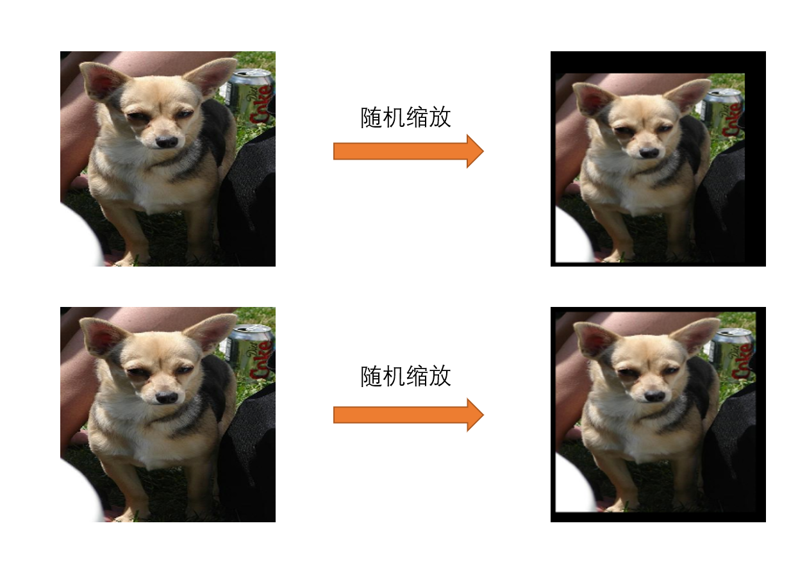

# YNU_Rookie
AI security competition  
2019年百度AI安全对抗赛
***
### 运行方法  
下载模型参数后将其放在根目录下，运行attack_code中的final_attack即可,结果图片保存在output文件夹下  
<a href="https://aistudio.baidu.com/aistudio/datasetdetail/19734">模型下载</a>  
本项目基于百度飞桨实现 
### 程序思路  
将训练好的模型在logits层进行融合，攻击方法选用了MI-FGSM+PGD，在攻击开始之前先对图像进行随机缩放，对图像的不同翻转方向进行求导操作后将所得梯度矩阵加权相加，最后完成对图片的攻击。  
流程图如下  
  
随机裁剪，翻转效果展示  

  
最终结果  
  
### 总结  
我们使用了干净模型和两种不同方法训练的防御模型按照以上思路进行对图片的攻击，最终得分为92.16排名第七。  
详情可参考<a href="https://github.com/Jin-TaoZhang/YNU_Rookie/blob/master/YNU_Rookie_WriteUp%20.pdf">writeup</a>
